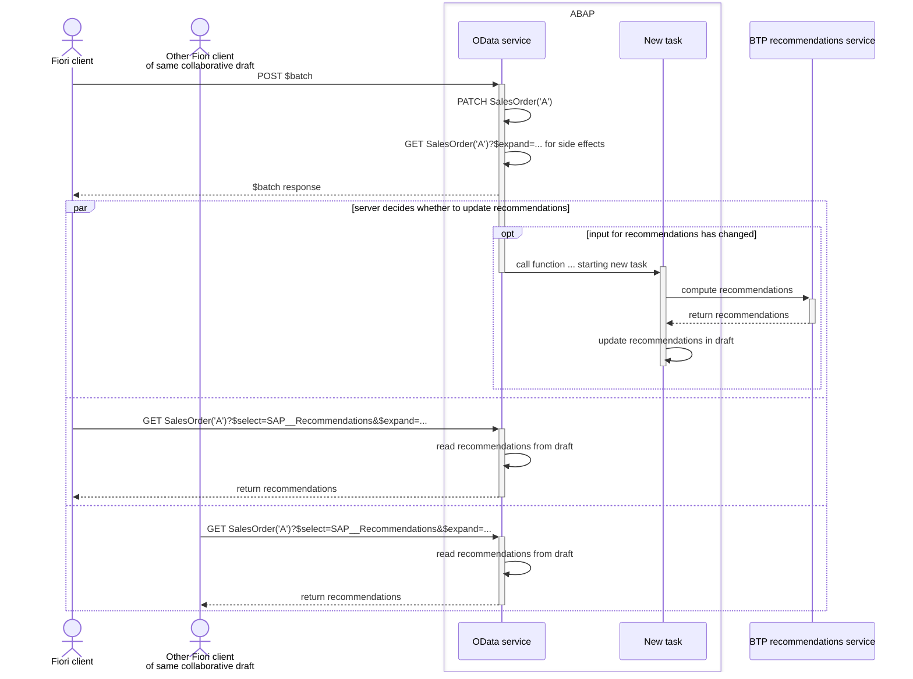
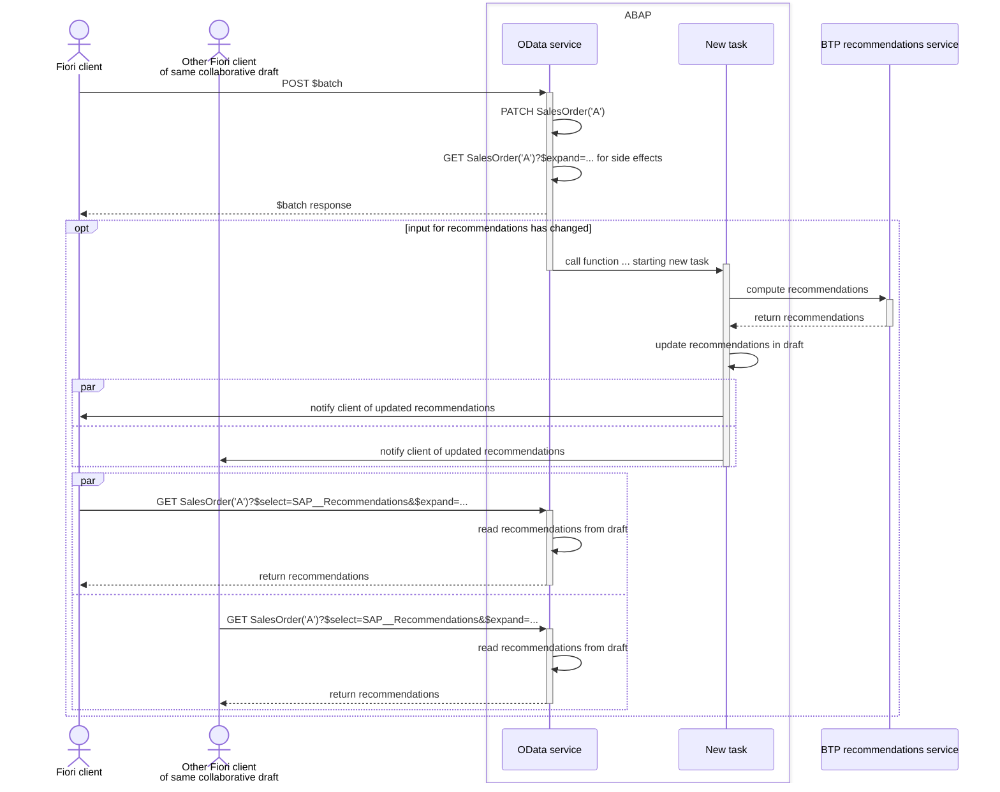

Entity types for which recommendations are available have an additional property `SAP__Recommendations` and the following annotation:
```xml
<EntityType Name="...">
  <Annotation Term="AI.Recommendations" Path="SAP__Recommendations" />
  ...
</EntityType>
```

Clients request recommendations from the server at their discretion.



Alternatively, clients can be notified via web socket if recommendations have been updated.


