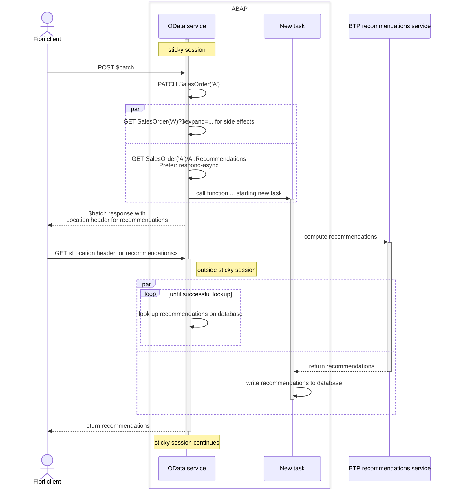
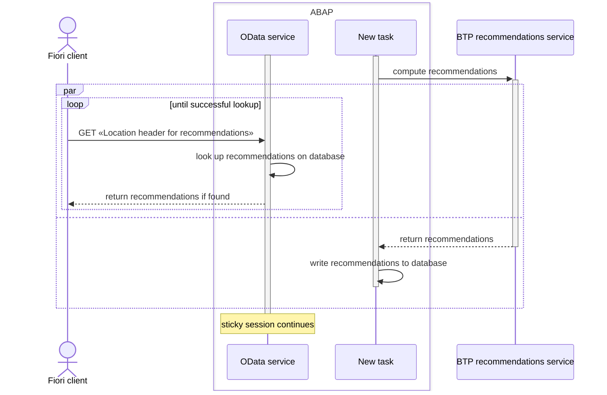
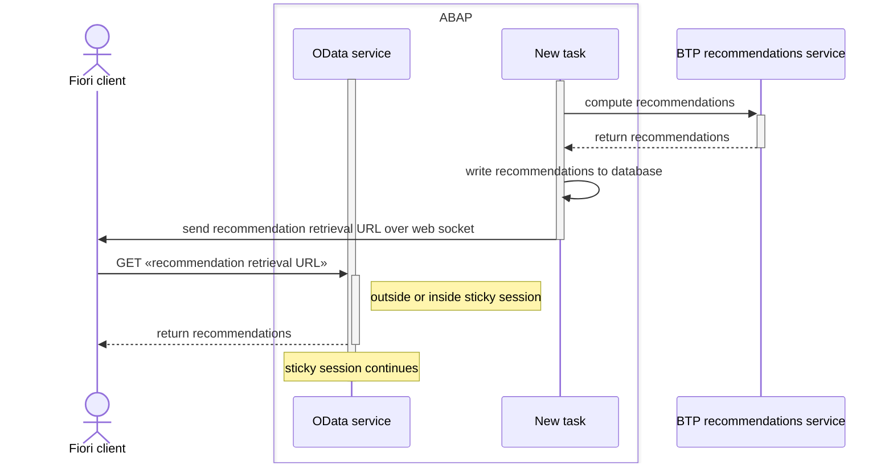

Invocation flow for a recommendations function implementing the signature of [`AI.Recommendations`](../vocabularies/AI.md#Recommendations)

Instead of "long polling" outside the sticky session, the client could also make repeated poll requests in the sticky session.
The lower half of the diagram then becomes:

Or the client could be notified via web socket when the recommendations are available:

