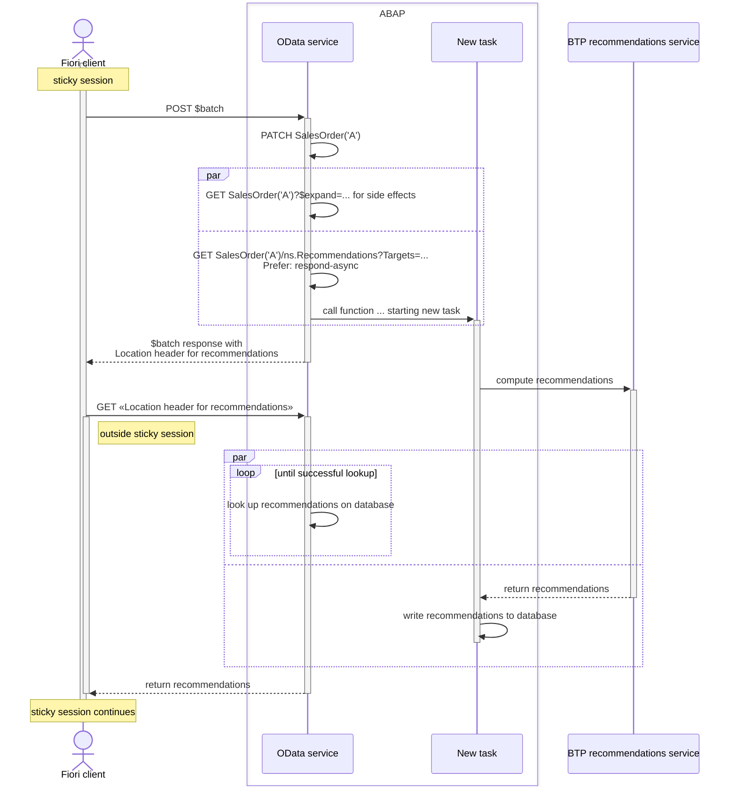
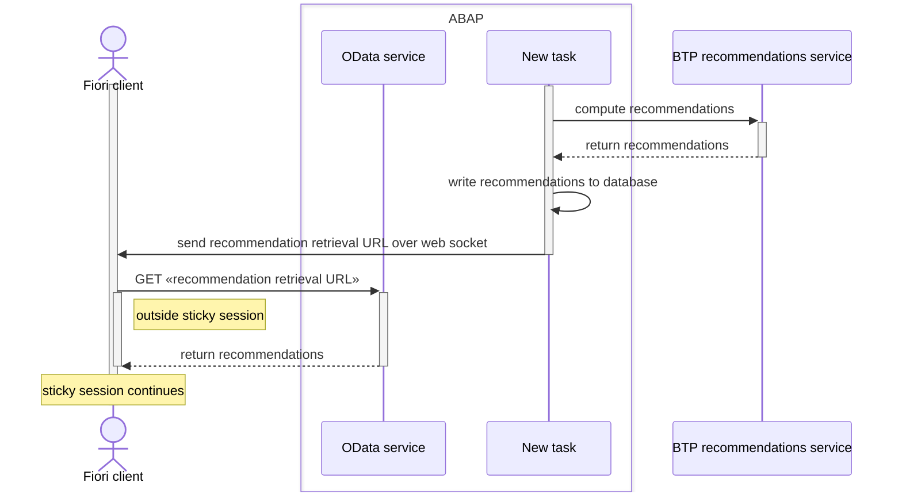

Invocation flow for a recommendations function annotated in [`Common.RecommendationsFunction`](../vocabularies/Common.md#RecommendationsFunction)

The lower half of the diagram could alternatively use a web socket:

